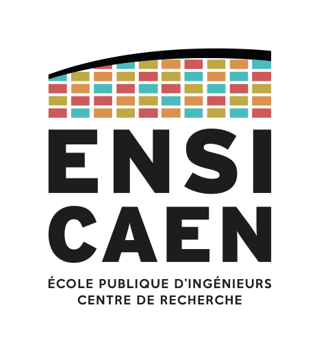

<h1> <a href="https://github.com/CCC-development-team/OASMR" style="text-align: center"> Projet OASMR - Compte rendu</a> </h1> 

**Objet** : Réunion Avancement 1

**Date** : 2018-12-13

| Participants                     | Absents       |
| -------------------------------- | ------------- |
| Pierre Chopinet (Chef de projet) | Pas d'absent  |
| Axel Cuissot                     |               |
| Julien Chevron                   |               |
| Paul Freifer                     |               |
| Patrick Lacharme (Tuteur)        |               |

Secrétaire de séance : Julien Chevron

### Points abordés

1.  Présentation de l'avancement au tuteur :

    Présentation des maquettes + début d'IHM
    
    Présentation et explication du Superviseur

2.  Sécurité de l'applicatiion :

    Communication Node Superviseur : Secret (RSA + AES)
    
    Authentification Client : Mot de passe

3.  Prochain RDV : 

    Janvier 2019, avant la soutenance de mi parcours.

### Relevé de Décisions/Actions

| N°   | Actions à mener                       | Qui    | Quand        |
| ---- | ------------------------------------- | ------ | ------------ |
| 1    | Sécurité de l'application             | Paul   | Rapidement   |
| 2    | Authentificatiion                     | Axel   | Janvier 2019 |
| 3    | Sauvegarde des Nodes                  | Pierre | Janvier 2019 |
| 4    | Poursuivre l'IHM                      | Julien | Janvier 2019 |
