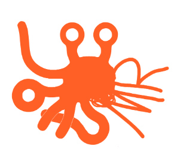

<h1> <a href="https://github.com/CCC-development-team/OASMR" style="text-align: center"> Projet OASMR - Compte rendu réunion </h1> 

**Objet** : jeej

**Date** : yyyy mm dd 

| Participants                     | Absents |
| -------------------------------- | ------- |
| Pierre Chopinet (Chef de projet) | Blabla  |
| Axel Cuissot                     |         |
| Julien Chevron                   |         |
| Paul Freifer                     |         |
| Patrick Lacharme (Tuteur)        |         |

Secrétaire de séance : 

### Points abordés

1.  Point n°1

2.  Point n°2

3.  Point n°3 

### Relevé de Décisions/Actions

| N°   | Actions à mener | Qui  | Quand |
| ---- | --------------- | ---- | ----- |
|      |                 |      |       |
|      |                 |      |       |